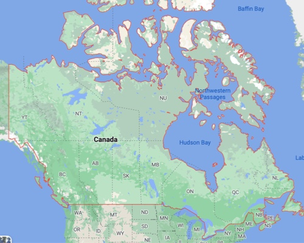

# 基本信息

加拿大（英语/法语：Canada），位于北美北部。东临大西洋，西临太平洋，西北部邻美国阿拉斯加州，南接美国本土，北靠北冰洋。气候大部分为亚寒带针叶林气候和湿润大陆性气候，北部极地区域为极地长寒气候。总面积 9980000平方千米，其中海岸线长约240000千米。截至2021年6月加拿大总人口为3813万，首都渥太华。




## 官网

一定要认准网址！


[https://www.canada.ca/en/services/immigration-citizenship.html](https://www.canada.ca/en/services/immigration-citizenship.html)


[https://www.cic.gc.ca/english/helpcentre/answer.asp?qnum=010&top=4](https://www.cic.gc.ca/english/helpcentre/answer.asp?qnum=010&top=4)


如果国内访问有问题，请寻找朋友帮忙或在群内寻求帮助。

## IRCC

IRCC （全称：Immigration, Refugees and Citizenship Canada） 是指加拿大移民难民和公民部。原为加拿大公民和移民部(CIC)，于2015年由加拿大新政府更改。 

请务必认准中介或者代办机构是否持有相关执照。

```mdx title="如何保持信息源的真实性？"
1. 利用政府机构网站查询它是否具有持牌资质
2. 进行多方信息求证，切不可轻信单一渠道，例如小红薯、朋友圈、广告电话等
3. 我们支持所有机构的付费咨询业务，但是对于普通人，任何付费前都应该三思

```

欢迎加入我们的沟通群 [Telegram Group](https://t.me/+iXB9--4MnxAzMjk1)

